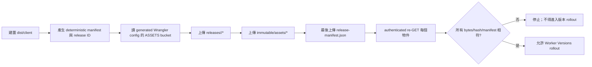
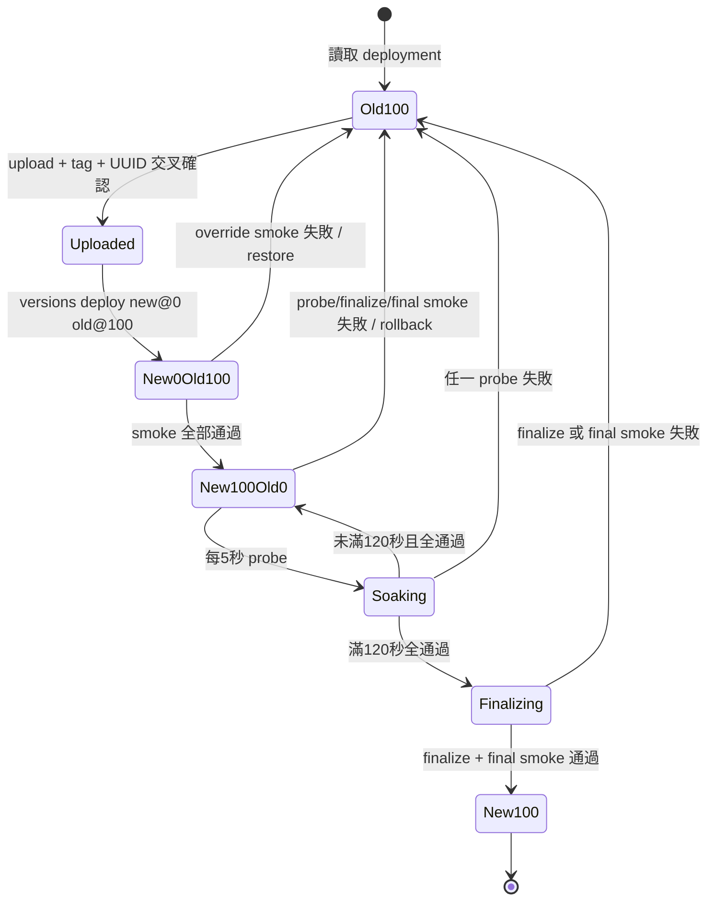

# 零停機部署筆記

> **適用日期：** 2026-07-12（staging，第一次上線）/ 2026-07-13（production，第二、三次上線）/ 2026-07-18–19（staging，PR #152）/ 2026-07-19（production，#150 edge-cache hotfix `00f47bd`；staging 重新校準回 `2898dd7`）。\
> **目的：** 給值班操作者與維護者的可執行說明。這份筆記是 `notes/重要路由筆記.md` 同等重要、但更完整的部署運行手冊。  
> **目前狀態（2026-07-19 更新第二次，已核實）：** **production 於 2026-07-19 已由 hotfix 更新**——現在跑 `00f47bd-3cd06b86b4ba`（hotfix tag `hotfix-150-edge-cache-23b7e89`：production 先前的 `23b7e89` + cherry-pick `c7aa7d0`／#150 edge-cache 真實啟用 + R2 memoize），version UUID `5247d558-9b71-4406-8080-8ba196d820c5` @100%（取代先前的 `2be488db-8ad7-4384-bc2a-c539b4196445`）。**`c7aa7d0` 本身已是 `main`／`2898dd7` 的祖先 commit**，故此 hotfix 與 main 線之間內容上無需回併——hotfix 分支只是較舊的部署工具鏈形狀，非 runtime 邏輯差異。換言之，**production 現在已經有 #150 的 edge cache 修復**（即時驗證：重複 GET 詞條 JSON 出現 `cf-cache-status: HIT`——本站走 proxied zone，zone 層 CDN 快取會在 Worker 執行前就攔截重複請求，所以 Worker 自身的 `X-Moedict-Edge-Cache` 標頭通常只在 staging 觀察得到、production 不一定會出現；`/api/config` 現在回應 public `max-age=60`／`s-maxage=300`；`stroke-json` 仍正常回 200，無回歸）。**staging 目前正由維運者重新校準回 `2898dd7`**（重新啟動 staging approval，為下一次 main 線出貨做準備）。
>
> **PR #152**（`整合六項 RESCOPE 議題修復、字詞操作列視覺強化與 xref sidecar 資料復原`）已於 2026-07-19 合併為 `main` 上的 commit `2898dd7`（`git merge-base --is-ancestor 23b7e89 2898dd7` 回 false——`2898dd7` 這條 `main` 歷史與 `23b7e89` 那條 stroke-corpus 出貨分支同樣互不為祖先，是各自獨立分岔後才在 `main` 匯合，`main` 這條線本身**包含** `c7aa7d0`/#150）。`2898dd7` 已部署至 **staging**（release `2898dd7-94a114836f12`，version UUID `c31a0716-7d3a-4826-a628-63f0fe49826f`，worker `cf-moedict-webkit-neo-staging`，桶 `moedict-assets-preview`，45 files + 49 objects authenticated re-GET 全過，rollout 100%，finalized `2026-07-18T23:34:53.301Z`；`staging-approval.json` = `{"gitSha":"2898dd7","clientManifestDigest":"94a114836f12"}`；live header 現場再次核對 `X-Moedict-Release: 2898dd7-94a114836f12`、`X-Moedict-Version: c31a0716-7d3a-4826-a628-63f0fe49826f` 相符）。**production 完全未被此次部署觸碰**——同一時刻現場核對 `www.moedict.tw` header 仍是 `X-Moedict-Release: 23b7e89-1d1f2400cb1d`、`X-Moedict-Version: 2be488db-8ad7-4384-bc2a-c539b4196445`，與 2026-07-13 出貨後完全未變；本 session 未執行過任何 `bun run deploy`（production 命令）。
>
> **本機/正式站資料層的帶外落差**：現行 `moedict-assets` R2 bucket 的 6,063 筆 `stroke-json/*` 物件與 R2 bucket CORS 白名單設定（`commands/r2-assets-cors.json`，見 `README_CDN.md` §2.1）都是 **prod 資料／設定層的帶外（out-of-band）狀態**——這些是直接對 R2/Cloudflare zone 操作寫入的，不是透過 §5 描述的兩階段版本 rollout 流程出貨的 Worker 程式碼變更；本筆記§5 的所有 rollout 保證（120 秒 probe、自動 rollback、`release-manifest.json` 完整性）只涵蓋 Worker 版本切換與其配套的 release-scoped R2 物件，不涵蓋這類獨立於 rollout 之外、由維運者直接對 R2/zone 執行的資料/設定寫入。
>
> **cache purge 已知限制**：`POST /api/cache/purge` 只清 Worker 側 Workers Cache 的 allowlist tag（`dict-*`、`list`、`search` 等），**不涵蓋** `r2-assets.moedict.tw` 這個獨立的 CDN 自訂網域快取；該網域的快取須透過 Cloudflare zone 的「按 URL／hostname 清除快取」功能另行處理（見 `README_CDN.md` §2.1）。這代表本筆記 §9 的手動恢復指令與 §7 失敗矩陣都無法觸及 CDN 層快取，只能觸及 Worker 側 Workers Cache 與 R2 release 物件。
>
> **本次修復引入的新落差（尚未部署，僅記錄，不代表任何 prod 動作）**：本次 `fix/post-152-review` 分支之上，除了 docs/hygiene 修正，還有其他並行 agent 正在把 `commands/sync-moe-stroke-corpus.mjs`／`src/api/handleStrokeAPI.ts` 從現行的扁平 `stroke-json/<hex>.json` key 改成不可變版本化前綴 + pointer/manifest 的 atomic corpus model（見 `AGENTS.md` §「筆順 JSON…atomic corpus model」，`git ls-files src/utils/stroke-corpus.ts` 目前為空，證實這是**尚未 commit 的工作樹變更**，不在已合併的 `2898dd7` 裡）。這代表：**若這次修復合併並部署到 production，讀取路徑會從扁平 key 切到 pointer/manifest 版本化 key，屬於一次新的、獨立的資料遷移**，前提是先完成一次 atomic corpus 上傳把 6,063 筆物件寫進新的 `stroke-corpora/<digest>/` 前綴並推進 `stroke-corpus/current.json` pointer——這是**部署前置條件**，不是此筆記本身要處理的動作，此處只記錄事實、不代表已經或即將對 production 執行任何操作。
>
> **#150 已不再是下一次 production rollout 的顧慮**：2026-07-19 的 hotfix `00f47bd` 已把 #150 的 edge-cache 修復直接上線 production，`c7aa7d0` 本身也已是 `main`（含 `2898dd7`／PR #152）的祖先 commit，故下一次從 `main` 出貨到 production 的部署**不會**再對 production 帶入任何與 #150 相關的新變更——此段落原先提醒的副作用已隨 hotfix 出貨而消解，僅保留供歷史對照。

## 1. 問題與根因

舊流程是 `vp run deploy` 呼叫原子式 `wrangler deploy`：新 Worker 一旦回報部署完成，就以 100% 流量取代舊 Worker。這不是漸進切換；若新版本有 shell 渲染、R2 binding 或邊界案例的 runtime 缺陷，所有使用者會同時受影響。重新部署舊程式也不是即時回復，還要再等約 60–90 秒的 edge propagation。

另一個已確認的失效路徑是 HTML shell：`renderHtmlShell` 呼叫 `SITE_ASSETS.fetch('/')`，遇到非 2xx 或例外時把結果轉成 `null`，後續 `dispatch()` 便落到 bare 404。全球 edge 傳播／快取更新之間存在短暫落差時，`SITE_ASSETS` 可能暫時 miss；因此即使 R2 有正確的 shell，仍可能看到短暫 404。這是「原子切換 + 靜態資產 miss 沒有恢復層」的組合風險。

本方案不把每一個 cold-cache 或平台傳播問題都宣稱為已證明的根因；它會以來源診斷標頭與結構化 log 把現象辨識出來，並先移除已證明的 `SITE_ASSETS → null → 404` fallthrough。

## 2. 不可破壞的不變量

- **可重現 release ID：** `<git-short-sha>-<client-manifest-digest 前 12 碼>`。digest 是 `dist/client/**`（包含所有一般建置檔案，唯獨 `release-manifest.json` 是發布完成標記、不納入自身 digest）的遞迴排序清單之 deterministic JSON 的 SHA-256；每筆含 `path`、檔案 byte-level `sha256`、`size`。
- **byte hash 是事實：** 發布與驗證都以檔案 bytes 計算 SHA-256 與長度，不以文字轉碼或檔名猜測完整性。
- **release-scoped key：** `releases/<release-id>/<relative-path>`；包括 `index.html`、manifest 與所有 `dist/client` 檔案。
- **全域 immutable key：** 只有 `assets/` 下符合 content-hash 的檔案才複製到 `immutable/assets/<relative-path>`。相對路徑原樣保留，絕不產生 `immutable/assets/assets/...`。
- **單一 key 推導來源：** Worker 與 Bun 發布程式共用 [`src/utils/release-keys.ts`](../src/utils/release-keys.ts)；拒絕空路徑、`..`（含編碼形式）、反斜線與空 segment。
- **manifest 最後發布：** 先完成 release tree 與 immutable assets，再最後上傳 `release-manifest.json`。manifest 出現代表物件集合已經上傳；任一上傳失敗不得發布 manifest。
- **authenticated re-download：** 上傳後以已驗證 Wrangler/R2 CLI 重新 GET 每一個物件，逐 byte 比對 hash/size；manifest 也要重新下載、驗證 schema、identity、git SHA、digest、檔案清單。429 或 Cloudflare error code 971 要以有上限的指數退避重試（最多 5 次；初始 1 秒、倍增、上限 60 秒），不能把限流誤判成內容損毀。
- **R2 與 Worker 的 fallback 順序：** shell 是 `SITE_ASSETS → R2 releases/<tag>/index.html → recovery 503`；資產是 `SITE_ASSETS → R2 release → immutable/assets（僅 hashed /assets）→ 既有 legacy fallback`。
- **恢復回應：** shell 兩個 store 都失敗（或 tag 缺失而跳過 R2）時只回 503，不回 404；`Cache-Control: no-store`、`Retry-After: 5`，body 有 5 秒 meta refresh。
- **tag 缺失安全：** 不得建構 `releases/unknown/...`；跳過 R2 release fallback。`X-Moedict-Version` 仍用 Cloudflare UUID，無 UUID 時為 `unknown`；沒有非空 tag 就完全省略 `X-Moedict-Release`。

### 發布順序



## 3. `CF_VERSION_METADATA` 與 R2 架構

Worker 的 `CF_VERSION_METADATA` 來源在 `wrangler.jsonc`（top-level 及 `env.staging` 都是 `{ "binding": "CF_VERSION_METADATA" }`，不可加 `type`）。其欄位意義不同：`.id` 是 Cloudflare version UUID；`.tag` 才是我們的 release ID；不可把 UUID 當 release tag。

發布程式必須讀建置後的 flattened config：`dist/cf_moedict_webkit_neo/wrangler.json`，從有效的 `ASSETS.bucket_name` 決定 bucket。production 與 staging 必須各用自己的 bucket：`moedict-assets` 與 `moedict-assets-preview`。不可把 staging 的 `ASSET_BASE_URL`（仍可能指向 production 公開網址）當作 preview release fallback 的目的地。

R2 key 的實際對應：

| 請求                        | release key                               | immutable key                        |
| --------------------------- | ----------------------------------------- | ------------------------------------ |
| `/index.html`               | `releases/<tag>/index.html`               | 不適用                               |
| `/assets/index-XXXXXXXX.js` | `releases/<tag>/assets/index-XXXXXXXX.js` | `immutable/assets/index-XXXXXXXX.js` |
| `/manifest.json`            | `releases/<tag>/manifest.json`            | 不適用                               |

v1 不做 automatic GC；release trees 與 immutable assets 為支援舊 tab 及 rollback 而保留。R2 put 不支援 `--cache-tag` 或 Cache-Tag flag；不要捏造這個參數，依賴 versioned/content-addressed keys 與 `Cache-Control`。

## 4. 每個回應的診斷標頭

外層 `dispatch` 對**每一個 Worker response**（成功、錯誤、fallback、HEAD、304、503）補上：

| 標頭                | 值／來源                                                              |
| ------------------- | --------------------------------------------------------------------- |
| `X-Moedict-Version` | `CF_VERSION_METADATA.id`（Cloudflare version UUID），沒有則 `unknown` |
| `X-Moedict-Release` | 非空 `CF_VERSION_METADATA.tag`（release ID）；tag 缺失時省略          |

只有相關路徑才有來源標頭：

| 標頭                     | 值                                                          | 意義                    |
| ------------------------ | ----------------------------------------------------------- | ----------------------- |
| `X-Moedict-Shell-Source` | `site-assets` / `r2-release` / `recovery`                   | HTML shell 由哪一層提供 |
| `X-Moedict-Asset-Source` | `site-assets` / `r2-release` / `r2-immutable` / `r2-legacy` | 資產由哪一層提供        |

R2 fallback 應保留 ETag、HTTP metadata、HEAD 空 body 與 `If-None-Match` → 304 行為；hashed immutable asset 使用 `public, max-age=31536000, immutable`，release shell 使用 `public, max-age=0, s-maxage=60`，miss/error 使用 `no-store`。R2 body 要直接 stream，不要為資產 `text()`/複製整個 body。

## 5. 兩階段版本 rollout

### 5.1 staging 先行與 approval gate

staging 是獨立 Worker `cf-moedict-webkit-neo-staging` 及 preview R2；production 是 `cf-moedict-webkit-neo`、`www.moedict.tw` 及 production R2。兩者不能混用 Worker、R2 或本地 deployment state；但 staging approval 是刻意共享的 gate。

production 在任何 mutating Wrangler call 之前，必須找到 staging 已成功完成的 approval，且同時符合：

1. git SHA 完全相同；
2. client manifest digest 完全相同；
3. production 自己重建後的 digest 也等於 staging 記錄。

因此「同一份 source」不夠，必須是同一個 git SHA + 同一個 manifest digest。state 的 current/version history 應按 environment 分隔；shared `staging-approval.json` 只供 production 讀 gate。

### 5.1a 冪等 tag 解析（retry-safe，upload 前先 list）

Cloudflare 的 Worker version tag（`annotations["workers/tag"]`）**可重複使用，不保證唯一**；但本專案的 release ID 是 deterministic（同一 git SHA + 同一 client manifest digest ⇒同一 tag）。因此若對同一次 build 重跑 `deploy`/`deploy:staging`（例如上一輪在 phase 1 smoke 失敗後才重試），舊的已上傳 version 仍帶著相同 tag 留在 Cloudflare 帳號裡——若不先確認就再次 `upload`，會讓該 tag 從此永遠模糊（ambiguous），後續任何 `findVersionByTag` 查詢都會失敗且無法自動復原。故 `release-deploy.mjs` 在任何 mutating 呼叫之前，先 `versions list` 查一次目前 tag 狀態：

- **0 筆符合**：正常路徑，`upload` 一次，再用既有的 upload-vs-list 交叉確認（見 5.2 第 3 點）。
- **恰好 1 筆符合**：直接重用該 UUID，**不再重複 upload**，記錄 `VERSION_STATUS.REUSED`；接著比對是否已等於目前唯一 100% 的 old version：
  - **相等**（即該 tag 已經是線上唯一版本——例如上一輪 finalize + final smoke 其實已成功，只是流程本身在回傳前中斷）：不做任何 mutating 呼叫，僅對 manifest routes 做一次 bounded 的 no-override final smoke 確認健康，通過後即回傳冪等成功（並照常寫入 finalized state；staging 額外 refresh shared approval），失敗則直接拋錯、不宣稱成功。
  - **不相等**（該 UUID 是先前失敗 run 遺留、已被踢出 deployment 但未刪除的 version）：照常往下走 new0/old100 → smoke → promote → probe → finalize 全流程，只是跳過 upload 這一步。
- **>1 筆符合**：在任何 mutating 呼叫之前 fail closed，錯誤訊息列出全部衝突 UUID，絕不猜測選哪一個——依 [`docs/superpowers/recovery.md`](../docs/superpowers/recovery.md) 人工診斷。

### 5.2 Phase 1：upload、new0 / old100、override smoke

1. `vp run build` 產生 `dist/client` 與 generated config；它不會計算 release manifest，也不會發布 R2。
2. Task 2 的 `release-publish` 計算 deterministic manifest/release ID，並完成 R2 publish/verify。
3. 只用 `wrangler versions upload --tag <release-id>` 上傳新 Worker version；**Wrangler 4.110 的 `versions upload` 沒有 `--json`**，由輸出文字的 `Worker Version ID:` 取得 UUID，再用 `versions list --json` 交叉確認。
4. 取得目前唯一的 old version（必須正好一個正流量 version 為 100%；0% residue 可被讀取器忽略，但不可有 split 正流量狀態）。
5. 部署 `new@0% old@100%`。`versions deploy` 使用 positional `UUID@percentage`，不是 `--version-tag`/`--percentage`。
6. 等待 edge propagation（預設 30 秒，injectable `propagationSleepMs`；過早 probe 會打到尚未收斂的 PoP 而誤判失敗），再對每一條 manifest-derived route 發 version override smoke。header 必須精確是：

   ```http
   Cloudflare-Workers-Version-Overrides: <exact-worker-name>="<new-version-uuid>"
   ```

   每次都要求 HTTP 200 且 `X-Moedict-Release` 精確等於 `<release-id>`；失敗時只 restore old@100，不能留下 new@0/old@100 的殘局。

### 5.3 Phase 2：new100 / old0、120 秒 probe、finalize

1. smoke 通過後部署 `new@100% old@0%`，讓兩個 version 暫時都存在；部署後先等 30 秒 edge propagation 再開始 probe。
2. 以 5 秒間隔對 custom domain／staging worker URL 持續 probe，至少 120 秒（HTML shell `s-maxage=60` 的兩倍）。所有 probe 都加唯一 cache-buster query，避免讀到本專案 edge cache 的舊結果。
3. 任一 probe 非 200、throw、或 release header 不符，立即部署 rollback `old@100% new@0%`；若 rollback 也失敗，錯誤必須同時保留原始錯誤與 rollback 錯誤。
4. 120 秒完整通過後 finalize：`new@100%` 單獨部署，之後同樣等 30 秒 propagation。
5. 不帶 override header 做 final smoke；仍要求 200 與正確 `X-Moedict-Release`，才寫 finalized/current state。staging 成功後才寫 shared approval。



## 6. Critical probes：必須由 manifest 推導

不可硬編碼某一次 build 的 hash 檔名。`deriveProbeRoutes()`（[`scripts/release-deploy.mjs`](../scripts/release-deploy.mjs)）從 manifest 找第一個 `assets/*.js` 與第一個 `assets/*.css`，並產生：

- `/`（HTML shell）
- `/api/config`
- `/api/%E8%90%8C.json`（dictionary API）
- `/<manifest 找到的 assets/*.js>`
- `/<manifest 找到的 assets/*.css>`

若 manifest 缺少 JS 或 CSS，部署在任何 mutating call 前 fail closed。production probe base URL 是 `https://www.moedict.tw`；staging 是 `https://cf-moedict-webkit-neo-staging.audreyt.workers.dev`（可由受控 override 指定）。

## 7. 失敗矩陣

| 失敗階段                                                     | 使用者影響                      | 自動動作                                          | 操作者動作                                                                             |
| ------------------------------------------------------------ | ------------------------------- | ------------------------------------------------- | -------------------------------------------------------------------------------------- |
| build／generated config／manifest 缺失                       | 尚未部署，線上不變              | 立即 fail closed，不呼叫 mutating API             | `vp run build`；確認 `dist/cf_moedict_webkit_neo/wrangler.json`、`dist/client`，再重試 |
| production approval SHA/digest 不符                          | 尚未部署，線上不變              | 在第一次 mutating call 前停止                     | 重新 staging build/驗證；不得手改 approval                                             |
| 舊 deployment 不是唯一 old@100                               | 不冒險切流，線上維持現狀        | abort                                             | 先用 `versions/deployments list --json` 查清 split；人工決定安全基線                   |
| R2 upload、429 重試耗盡或 authenticated re-GET hash mismatch | 新 release 尚未可用，舊線上不變 | 不上傳 manifest／不進 rollout                     | 查 bucket、key、限流；確認 generated config 指到正確環境後重跑                         |
| version upload/列表 tag 或 UUID 交叉確認失敗                 | 仍未切流                        | 記錄 confirm failure，停止                        | 檢查 `annotations['workers/tag']`；不要猜 UUID 或手動混版                              |
| Phase 1 override smoke 失敗                                  | live 仍 old@100                 | restore old@100 **單一 version**                  | 讀 response/status/headers；修正新 build 後重新 staging                                |
| promote 後 120 秒 probe 失敗                                 | 短暫可能已收到新版本錯誤        | 立即 rollback old@100/new@0                       | 確認 rollback 結果；若顯示 ROLLBACK ALSO FAILED，升級並停止重試                        |
| finalize 失敗                                                | 仍可能是 new/old split          | 自動 rollback old@100/new@0                       | 驗證 deployment list 真的收斂到 old@100                                                |
| final smoke 失敗                                             | 新版尚未被宣告成功              | rollback old@100/new@0                            | 保存兩個錯誤；修版，不要直接 atomic deploy                                             |
| `SITE_ASSETS` shell non-OK/throw                             | 可能遇到延遲，但不應 404        | R2 release fallback；R2 也失敗則 503 no-store     | 看 `shell-miss` log 與來源標頭，辨別 site-assets gap 或 R2 問題                        |
| `SITE_ASSETS` asset miss                                     | 特定資產可能 miss               | release key → immutable key →既有 legacy fallback | 由 `X-Moedict-Asset-Source` 判斷哪層命中                                               |
| shell 的 SITE_ASSETS、R2 都失敗／tag 空                      | 該次 shell 回 503               | `Retry-After: 5`、no-store、自動 refresh          | 依 version/release/CF Ray 查 log；修復 store 或 deployment，不清除診斷標頭             |
| rollback/restore 也失敗                                      | 可能持續服務壞版本或 split      | 錯誤同時報告原故障與第二故障                      | 立即人工以 positional UUID@100% 恢復，並確認 deployments list                          |

## 8. 觀測與 troubleshooting

### 8.1 先看 response headers

```bash
curl -sS -D - -o /dev/null 'https://www.moedict.tw/?release-debug=1'
curl -sS -D - -o /dev/null 'https://www.moedict.tw/assets/<manifest-derived-hash>.js?release-debug=1'
```

- `X-Moedict-Version`：目前 Cloudflare version UUID；用於與 Wrangler versions/deployments 對照。
- `X-Moedict-Release`：目前 release ID；缺失表示 metadata tag 空或舊 version 尚未帶 binding。
- shell 的 `site-assets`：正常 fast path；`r2-release`：SITE_ASSETS miss 後 R2 release 命中；`recovery`：兩邊都失敗、應為 503。
- asset 的 `site-assets`、`r2-release`、`r2-immutable`、`r2-legacy`：逐層指出命中來源。`r2-legacy` 是直接 ASSETS bucket 的 legacy path，不是外部 `ASSET_BASE_URL` proxy。
- 503 必須有 `Cache-Control: no-store` 與 `Retry-After: 5`；不要讓 recovery 被 cache。

### 8.2 看結構化 log

shell miss 的 log event 是 `shell-miss`，欄位包括：`pathname`、`cfRay`、`versionId`、`releaseTag`、`siteAssetsResult`（`non-ok`/`throw`/`no-fetcher`）、`siteAssetsStatus`、`r2Attempted`、`r2Key`、`r2Result`（`hit`/`miss`/`throw`/`skipped`）、`finalSource`、`finalStatus`。不記錄 secrets。

判斷方式：

1. `siteAssetsResult=non-ok|throw` 且 `r2Result=hit`、`finalSource=r2-release`：是 SITE_ASSETS／edge gap，R2 正常。
2. `r2Result=miss|throw` 且 `finalSource=recovery`：R2 key、bucket、publish 或 binding 需查；若 tag 也空，則是 metadata/bootstrap 問題。
3. asset `r2-immutable`：新 Worker 正在服務舊 tab 的 hashed URL，屬預期相容路徑。
4. 回應 header 的 release 與 probe 期待不符：先查 version override 是否指到正確 Worker name/UUID，以及 `annotations['workers/tag']`，不要先歸咎快取。

## 9. 安全的手動恢復指令

以下指令只作人工 recovery；`<generated-config>`、`<worker-name>`、`<uuid>`、`<bucket>`、`<key>` 都是**明確 placeholder，執行前必須替換**。一律用專案 wrapper `vp exec wrangler`，並使用建置後 generated config。**禁止建議或執行裸 `wrangler deploy`**；它是 atomic cutover，沒有本協議的安全 gate。

```bash
# 先確認登入身份與目前版本（唯讀）
vp exec wrangler whoami
vp exec wrangler versions list --config <generated-config> --name <worker-name> --json
vp exec wrangler deployments list --config <generated-config> --name <worker-name> --json

# 將已知良好 old UUID 恢復 100%（positional UUID@percentage）
vp exec wrangler versions deploy --config <generated-config> \
  <known-good-old-uuid>@100% -y

# 若要明確清掉仍在 deployment 的新 UUID，使用 old@100 + new@0
vp exec wrangler versions deploy --config <generated-config> \
  <known-good-old-uuid>@100% <bad-new-uuid>@0% -y

# 唯讀確認恢復結果
vp exec wrangler deployments list --config <generated-config> --name <worker-name> --json

# 人工查 R2（<bucket> 必須是 generated config 的 ASSETS.bucket_name）
vp exec wrangler r2 object get <bucket>/releases/<release-id>/release-manifest.json \
  --remote --file=/tmp/release-manifest.json
vp exec wrangler r2 object get <bucket>/releases/<release-id>/index.html \
  --remote --file=/tmp/release-index.html
```

不要用 `--version-id`、`--percentage` 或 `--version-tag` 取代 positional `UUID@percentage`；不要把 production bucket 寫入 staging，也不要把 token、account ID 或 secrets 寫入筆記或 shell history。另外：`versions deploy` 之後先等約 30 秒 edge propagation 再用 URL/curl 驗證——過早 probe 可能打到尚未收斂的 PoP、把成功的恢復誤判成失敗（orchestrator 內建這個等待，人工恢復時要自己等）。

## 10. 來源、測試與目前待辦

核心實作與測試：

- Worker fallback、metadata、headers：[`src/api/release-fallback.ts`](../src/api/release-fallback.ts)、[`worker/index.ts`](../worker/index.ts)、[`tests/unit/release-fallback.test.ts`](../tests/unit/release-fallback.test.ts)、[`tests/unit/worker-dispatch-edges.test.ts`](../tests/unit/worker-dispatch-edges.test.ts)。
- key safety：[`src/utils/release-keys.ts`](../src/utils/release-keys.ts)、[`tests/unit/release-keys.test.ts`](../tests/unit/release-keys.test.ts)。
- deterministic manifest、R2 publish/verify、generated config：`scripts/lib/release-manifest.mjs`、`scripts/lib/r2-upload.mjs`、`scripts/lib/release-verify.mjs`、`scripts/lib/generated-config.mjs` 及對應 `tests/unit/release-manifest.test.ts`、`generated-config.test.ts`、`r2-upload.test.ts`、`release-verify.test.ts`。
- rollout：[`scripts/release-deploy.mjs`](../scripts/release-deploy.mjs)、`scripts/lib/wrangler-versions.mjs`、`scripts/lib/smoke-probe.mjs`、`scripts/lib/deployment-state.mjs`；測試為 `tests/unit/release-deploy.test.ts`、`wrangler-versions.test.ts`、`smoke-probe.test.ts`、`deployment-state.test.ts`。
- 緊急單一目標 rollback：[`scripts/release-rollback.mjs`](../scripts/release-rollback.mjs)（`tests/unit/release-rollback.test.ts`），重用 rollout 的 `wrangler-versions.mjs`/`smoke-probe.mjs`/`deployment-state.mjs`，刻意不依賴 build manifest。與 rollout 相同，在 `target@100%/current@0%` 切換後、bounded final smoke 之前等 30 秒 edge propagation（預設，injectable）——否則過早 probe 誤判失敗會觸發 restore、把流量切回你正要逃離的壞版本。
- deploy 安全鏈與靜態守門：`package.json` 的 `deploy`/`deploy:staging`/`deploy:rollback`/`deploy:publish-only`（`tests/unit/package-deploy-scripts.test.ts`）、CI 靜態守門 `scripts/check-deploy-scripts-safety.mjs`（`.github/workflows/ci.yml` static job）、focused release orchestrator coverage 命令 `bun run test:coverage:release`（unit job 亦於 CI 執行；`scripts/release-*.mjs` 不在全域 src/\*\* ratchet 內，這是它們唯一的 coverage gate，曾在 #144 因僅手動執行而悄悄轉紅。thresholds 為 100/100/100/100 的只升不降地板；真正無法在單元測試安全執行的 default（spawn 真 wrangler、真 setTimeout sleep）以附理由的 `v8 ignore start/stop` 標示——mid-expression 的 `v8 ignore next` 不會被 vitest v8 provider 認得，且會誤遮下一行，勿再使用）。
- design、任務報告與 Task 4 整合報告：[`docs/superpowers/specs/2026-07-12-zero-downtime-release-design.md`](../docs/superpowers/specs/2026-07-12-zero-downtime-release-design.md)、`.superpowers/sdd/task-1-report.md`、`task-2-report.md`、`task-3-report.md`、`task-4-report.md`（gitignored，本機參考用）。
- Wrangler 4.110.0 ground truth：`versions upload` 無 `--json`；tag 在版本條目的 `annotations['workers/tag']`；`versions deploy` 是 positional `UUID@percentage`；R2 put 無 Cache-Tag flag。這些事實以 Task 3/Task 2 reports 與實際 `vp exec wrangler --help` 驗證為準。

### Task 4／出貨後由維護者更新的 checklist

- [x] `package.json` 的 `deploy`／`deploy:staging` 已 clean cutover 至 `vp run build && node scripts/release-publish.mjs && node scripts/release-deploy.mjs`（production 每段都加 `env -u CLOUDFLARE_ENV` 前綴，fail-closed 對抗外層繼承的 `CLOUDFLARE_ENV=staging`；staging 每段各帶 `CLOUDFLARE_ENV=staging`），沒有標準命令可走裸 `wrangler deploy`（偵測邏輯是 shell-segment/token 掃描，能抓到 `wrangler --env x deploy`、`vp exec wrangler --config y deploy` 這類夾了 global flag 的變體，同時放行安全的 positional `wrangler versions deploy`）；由 `tests/unit/package-deploy-scripts.test.ts`、`tests/unit/jsonc.test.ts` 與 CI 的 `scripts/check-deploy-scripts-safety.mjs` 鎖定。
- [x] `deploy:rollback`／`deploy:rollback:staging` 是真正實作（`scripts/release-rollback.mjs`，非 stub），`deploy:publish-only`／`deploy:publish-only:staging` 語意與本文一致，皆使用 generated config；20+ 個 focused 測試涵蓋成功／smoke 失敗自動 restore／雙重失敗回報／refuse target=current／refuse 未知 UUID 或 tag／refuse split state。
- [x] `AGENTS.md`、`README.md`、`docs/superpowers/recovery.md` 已同步此流程與 positional recovery 命令。
- [x] `wrangler.jsonc` top-level 與 `env.staging` 都有正確 `version_metadata` binding（無 `type` 屬性），由 `tests/unit/package-deploy-scripts.test.ts` 與 CI 靜態守門鎖定。
- [x] staging 已以實際 preview Worker/R2 完成 build → publish/verify → two-phase rollout → 120 秒 probe → final smoke。  
       **歷史紀錄（2026-07-12 首次 staging 出貨）：** release ID `8fc64f2-5db141ad4cd4`；version UUID `b5d0fc27-7372-4607-8232-d07abe6c3a3b`；worker `cf-moedict-webkit-neo-staging` @ 100%（finalized `2026-07-12T13:11:27.704Z`）；R2 bucket `moedict-assets-preview` key prefix `releases/8fc64f2-5db141ad4cd4/`（45 files + manifest，authenticated re-GET OK）。  
       **現行 staging（2026-07-13，與 production 同 release）：** release ID `23b7e89-1d1f2400cb1d`；version UUID `0f23b628-9373-45d5-8ee9-b7d20b14933b`；worker `cf-moedict-webkit-neo-staging` @ 100%（finalized `2026-07-13T04:00:28.202Z`）；shared approval `gitSha=23b7e89`、`clientManifestDigest=1d1f2400cb1d`；preview 桶另含完整 6,063 筆 `stroke-json/*`（sha256 全量驗證 OK）。
      **PR #152 staging（2026-07-18，main 上的 `2898dd7`，與 production 不同 release）：** release ID `2898dd7-94a114836f12`；version UUID `c31a0716-7d3a-4826-a628-63f0fe49826f`；worker `cf-moedict-webkit-neo-staging` @ 100%（finalized `2026-07-18T23:34:53.301Z`）；shared approval `gitSha=2898dd7`、`clientManifestDigest=94a114836f12`；桶 `moedict-assets-preview`，45 files + 49 objects authenticated re-GET OK；即時核對（本次任務，2026-07-19）`curl -sD-` 對 `cf-moedict-webkit-neo-staging.audreyt.workers.dev` header 仍為 `X-Moedict-Release: 2898dd7-94a114836f12`、`X-Moedict-Version: c31a0716-7d3a-4826-a628-63f0fe49826f`，與紀錄相符。**未觸及 production**——同次即時核對 `www.moedict.tw` header 仍為 `23b7e89-1d1f2400cb1d`／`2be488db-8ad7-4384-bc2a-c539b4196445`，與 2026-07-13 出貨後完全一致；本次任務未執行任何 `bun run deploy`（production）指令。
- [x] production gate 核對同一 git SHA + 同一 manifest digest，並以 production 自己重建 digest 再驗一次。**已於 2026-07-13 執行：** approval `{ gitSha: "23b7e89", clientManifestDigest: "1d1f2400cb1d" }` 與 production rebuild 的 release ID `23b7e89-1d1f2400cb1d` 一致；gate 通過後才進入 mutating publish/rollout。
- [x] production rollout、final smoke、headers/logs 與 R2 fallback 已在 `www.moedict.tw` 實際觀察。**事實紀錄（2026-07-13）：**
  - **已部署 runtime source HEAD `23b7e89`**；release ID `23b7e89-1d1f2400cb1d`；version UUID `2be488db-8ad7-4384-bc2a-c539b4196445`；worker `cf-moedict-webkit-neo` @ 100%（finalized `2026-07-13T06:45:16.967Z`）；
  - 路徑：`bun run deploy` = `env -u CLOUDFLARE_ENV vp run build && release-publish.mjs && release-deploy.mjs`（單次成功，無 rollback）；
  - release publish：bucket `moedict-assets`，45 files + authenticated re-GET 49 objects OK；
  - live core probes `/` `/api/config` 與華語詞頁皆 200 且 `X-Moedict-Release: 23b7e89-1d1f2400cb1d` + `X-Moedict-Version: 2be488db-8ad7-4384-bc2a-c539b4196445`；
  - 筆順語料：`moedict-assets/stroke-json/*` 6,063 物件 authenticated re-GET + sha256／bytes 全量 OK；暫態 retry 分類硬化見 commit `42a730f`（upload 預設 maxRetries=5）；首輪 verify 遇 `fetch failed` 耗盡當時預設 5 後重跑全量通過——**現行腳本無 built-in verify checkpoint/resume**（建議後續 operator 優化）；script-only follow-up `a8d3262` 將 verify 預設 maxRetries 提到 8（**不需再部署 Worker**）；
  - 抽樣 30 個 stroke-json key GET/HEAD/304/hash/bytes 全過；缺字 `0001`/`ffff`→404、非法 `zzzz`→400；瀏覽器端「汛」「町」筆順 canvas 正常、無 missing badge。
- [x] 保留 deployment state、probe 結果、manifest digest 與 rollback 結果。staging 證據於 worktree `.wrangler/releases/staging/` 與 `staging-approval.json`；production 證據於 `.wrangler/releases/production/current.json`（`tag=23b7e89-1d1f2400cb1d`、`versionId=2be488db-8ad7-4384-bc2a-c539b4196445`、`percentage=100`、`deployedAt=2026-07-13T06:45:16.967Z`）。
- [x] **2026-07-19 hotfix ship：** production 的 #150 edge-cache 修復（`c7aa7d0`）以 hotfix 分支 `hotfix-150-edge-cache-23b7e89`（= production 先前的 `23b7e89` + cherry-pick `c7aa7d0`）直接上線，release ID `00f47bd-3cd06b86b4ba`，version UUID `5247d558-9b71-4406-8080-8ba196d820c5` @100%（取代 `2be488db-8ad7-4384-bc2a-c539b4196445`）。即時驗證：重複 GET 詞條 JSON 出現 `cf-cache-status: HIT`（proxied zone 的 CDN 層在 Worker 執行前攔截重複請求，Worker 自身 `X-Moedict-Edge-Cache` 標頭因此通常只在 staging 觀察得到）；`/api/config` 回應 public `max-age=60`／`s-maxage=300`；`stroke-json` 仍正常回 200，無回歸。`c7aa7d0` 本身已是 `main`／`2898dd7` 的祖先 commit，故此 hotfix 內容上無需回併 main——hotfix 分支只是較舊的部署工具鏈形狀。同時，staging 由維運者重新校準回 `2898dd7`（重新啟動 staging approval，為下一次 main 線出貨做準備）。

## 11. 保證範圍與非保證範圍

**保證（在流程、binding、R2 與 edge 平台正常運作的前提下）：** 不再以標準 deploy 命令把未 smoke 的新版本一次切到 100%；新版本會先 0% override smoke，再 100%／0% 至少 120 秒持續 probe，失敗自動回 old@100；HTML shell 不會因 `SITE_ASSETS` miss 直接 fallthrough 成 404，而是嘗試 release R2 或回 503 no-store；release 物件有 deterministic identity、manifest-last 與 authenticated byte verification；舊 tab 的 hashed assets 可經 global immutable fallback 找回。

**不保證：** Cloudflare 全球 edge 永遠零延遲、SITE_ASSETS 永不 miss、R2 或 Worker binding 永不故障、所有第三方／legacy `ASSET_BASE_URL` 資產都能恢復、120 秒後不會出現新的缺陷、瀏覽器已快取內容會立即更新，或 deployment rollback 在 Cloudflare 控制面故障時必定成功。`cross_version_cache` 不在 v1；immutable/release 物件也不自動 GC。這個流程降低 blast radius、提供可觀測恢復路徑，但不是對平台故障或程式正確性的絕對保證。
